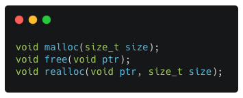

# Malloc
Just so you know the code is not very well written, the allocation works like expected, freeing and reallocating memory likewise. Once again if you're looking for a well optimized, genius code... I'm sorry but most likely you'll be disappointed :)))))

This project is about implementing a dynamic memory allocation mechanism.

# Mechanism
In C, the library function **malloc** is used to allocate a **block of memory** on the **heap**. The program accesses this block of memory via a pointer that malloc returns. When the memory is no longer needed, the pointer is passed to function **free** which deallocates the memory so that it can be used for other purposes.
The last function is called **realloc**. It changes size of allocated memory, preserve data and returns a pointer to its block of memory.

# General
Our library contains implementation of functions I mentioned before:
  - [x] `malloc`
  - [x] `free`
  - [x] `realloc`
  - [ ] `show_alloc_mem`

######  :bulb: To better understand this project check *malloc.pdf* file
