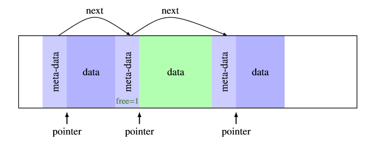

# Malloc
<!--Just so you know the code is not very well written neither optimized, the allocation works as expected tho, freeing and reallocating memory likewise-->

This project is about implementing a dynamic memory allocation mechanism.

In C, the library function **malloc** is used to allocate a **block of memory** on the **heap**. The program accesses this block of memory via a pointer that malloc returns. When the memory is no longer needed, the pointer is passed to function **free** which deallocates the memory so that it can be used for other purposes.
The last function is called **realloc**. It changes size of allocated memory, preserve data and returns a pointer to its block of memory.

# Mechanism
Each chunk contains small black of extra information called meta-data. This block contains at least a pointer to the next chunk, a flag to mark free chunks and the size of the data of the chunk. This block of information is before the pointer returned by *malloc*.

 

# General
Our library contains implementation of functions I mentioned before:
  - [x] `malloc`
  - [x] `free`
  - [x] `realloc`
